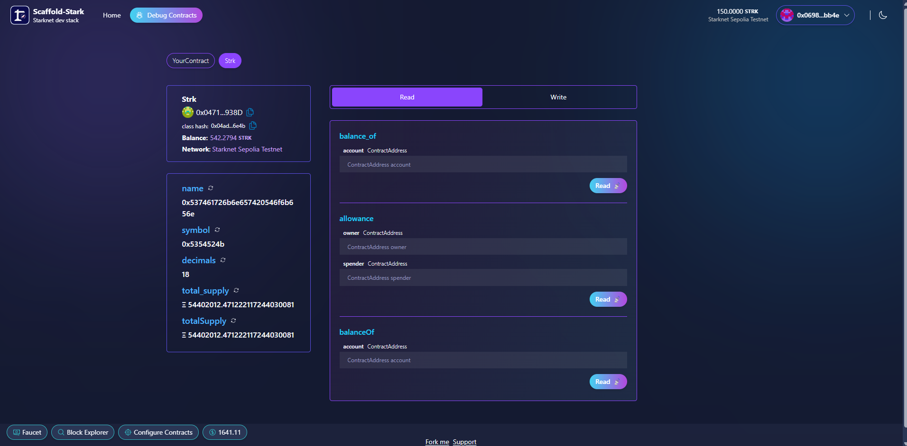
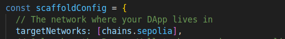
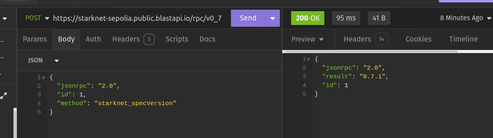

# 🏗 Scaffold-Stark

<h4 align="center">
  <a href="https://www.docs.scaffoldstark.com/">Documentation</a> |
  <a href="https://www.scaffoldstark.com/">Website</a> |
  <a href="https://scaffold-stark-demo.vercel.app/debug">Demo</a>
</h4>

🧪 An open-source, up-to-date toolkit for building decentralized applications (dapps) on Starknet blockchain. It's designed to make it easier for developers to create and deploy smart contracts and build user interfaces that interact with those contracts.

⚙️ Built using NextJS, Starknet.js, Scarb, Starknet-React, Starknet Foundry and Typescript.

- ✅ **Contract Fast Reload**: Your frontend auto-adapts to your smart contracts as you deploy them.
- 🪝 [**Custom hooks**](https://www.docs.scaffoldstark.com/hooks/): Collection of React hooks wrapper around [starknet-react](https://starknet-react.com/) to simplify interactions with smart contracts with typescript autocompletion.
- 🧱 [**Components**](https://www.docs.scaffoldstark.com/components): Collection of common web3 components to quickly build your frontend.
- 🔥 **Burner Wallet & Prefunded Account**: Quickly test your application with a burner wallet and prefunded accounts.
- 🔐 **Integration with Wallet Providers**: Connect to different wallet providers and interact with Starknet network.



## Requirements

Before you begin, you need to install the following tools:

- [Node (>= v18.17)](https://nodejs.org/en/download/)
- Yarn ([v1](https://classic.yarnpkg.com/en/docs/install/) or [v2+](https://yarnpkg.com/getting-started/install))
- [Git](https://git-scm.com/downloads)
- [Rust](https://www.rust-lang.org/tools/install)
- [asdf](https://asdf-vm.com/guide/getting-started.html)
- [Cairo 1.0 extension for VSCode](https://marketplace.visualstudio.com/items?itemName=starkware.cairo1)

### Starknet-devnet version

To ensure the proper functioning of scaffold-stark, your local `starknet-devnet` version must be `0.2.0`. To accomplish this, first check your local starknet-devnet version:

```sh
starknet-devnet --version
```

If your local starknet-devnet version is not `0.2.0`, you need to install it.

- Install Starknet-devnet `0.2.0` via `asdf` ([instructions](https://github.com/gianalarcon/asdf-starknet-devnet/blob/main/README.md)).

### Scarb version

To ensure the proper functioning of scaffold-stark, your local `Scarb` version must be `2.8.3`. To accomplish this, first check your local Scarb version:

```sh
scarb --version
```

If your local Scarb version is not `2.8.3`, you need to install it.

- Install Scarb `2.8.3` via `asdf` ([instructions](https://docs.swmansion.com/scarb/download.html#install-via-asdf)).

### Starknet Foundry version

To ensure the proper functioning of the tests on scaffold-stark, your Starknet Foundry version must be 0.31.0. To accomplish this, first check your Starknet Foundry version:

```sh
snforge --version
```

If your Starknet Foundry version is not `0.31.0`, you need to install it.

- Install Starknet Foundry `0.31.0` via `asdf` ([instructions](https://foundry-rs.github.io/starknet-foundry/getting-started/installation.html#installation-via-asdf)).

## Compatible versions

- Starknet-devnet - v0.2.0
- Scarb - v2.8.3
- Snforge - v0.31.0
- Cairo - v2.8.2
- Rpc - v0.7.1

## Quickstart with Starknet-Devnet

To get started with Scaffold-Stark, follow the steps below:

1. Clone this repo and install dependencies

```bash
git clone https://github.com/Scaffold-Stark/scaffold-stark-2.git
cd scaffold-stark-2
yarn install
```

2. Prepare your environment variables.

By default Scaffold-Stark 2 takes the first prefunded account from `starknet-devnet` as a deployer address, thus **you can skip this step!**. But if you want use the .env file anyway, you can fill the env variables related to devnet with any other predeployed contract address and private key from starknet-devnet.

> In case you want to deploy on Sepolia, you need to fill the envs related to sepolia testnet with your own contract address and private key.

```bash
cp packages/snfoundry/.env.example packages/snfoundry/.env
```

3. Run a local network in the first terminal.

> 💬 Hint: You can skip this step if you plan to use Sepolia Testnet.

```bash
yarn chain
```

> To run a fork : `yarn chain --fork-network <URL> [--fork-block <BLOCK_NUMBER>]`

This command starts a local Starknet network using Devnet. The network runs on your local machine and can be used for testing and development. You can customize the network configuration in `scaffold.config.ts` for your nextjs app.

> If you are on sepolia or mainnet, for a better user experience on your app, you can get a dedicated RPC from [Infura dashboard](https://www.infura.io/). A default is provided [here](https://github.com/Quantum3-Labs/scaffold-stark-2/tree/main/packages/nextjs/.env.example), in order to use this, you have to run `cp packages/nextjs/.env.example packages/nextjs/.env.local`

4. On a second terminal, deploy the sample contract:

```bash
yarn deploy
```

> To use `Sepolia` testnet, you input `yarn deploy --network sepolia`.

This command deploys a sample smart contract to the local network. The contract is located in `packages/snfoundry/contracts/src` and can be modified to suit your needs. The `yarn deploy` command uses the deploy script located in `packages/snfoundry/scripts-ts/deploy.ts` to deploy the contract to the network. You can also customize the deploy script.

By default `Scaffold-Stark` takes the first prefunded account from `starknet-devnet` as a deployer address,

5. On a third terminal, start your NextJS app:

```bash
yarn start
```

Visit your app on: `http://localhost:3000`. You can interact with your smart contract using the `Debug Contracts` page. You can tweak the app config in `packages/nextjs/scaffold.config.ts`.

5. Check your environment variables. We have a yarn postinstall script that helps to fill in your environment variables. If the environment variable does not exist, you can fill them it manually to get the app running!

## Quickstart with Sepolia Testnet

<details>

1. Make sure you alredy cloned this repo and installed dependencies.

2. Prepare your environment variables.

Find the `packages/snfoundry/.env` file and fill the env variables related to Sepolia testnet with your own wallet account contract address and private key.

3. Change your default network to Sepolia testnet.

Find the `packages/nextjs/scaffold.config.ts` file and change the `targetNetworks` to `[chains.sepolia]`.



4. Get some testnet tokens

You will need to get some `ETH` or `STRK` Sepolia tokens to deploy your contract to Sepolia testnet.

> Some popular faucets are [Starknet Faucet](https://starknet-faucet.vercel.app/) and [Blastapi Starknet Sepolia Eth](https://blastapi.io/faucets/starknet-sepolia-eth)

4. Open a terminal, deploy the sample contract to Sepolia testnet:

```bash
yarn deploy --network sepolia
```

5. On a second terminal, start your NextJS app:

```bash
yarn start
```

Visit your app on: `http://localhost:3000`. You can interact with your smart contract using the `Debug Contracts` page. You can tweak the app config in `packages/nextjs/scaffold.config.ts`.

### RPC specific version

To ensure the proper functioning of the scaffold-stark with Testnet or Mainnet, your RPC version must be `0.7.1`. This repository contains a `.env.example` file, where we provided the default RPC URL for the Starknet Testnet: `RPC_URL_SEPOLIA=https://starknet-sepolia.public.blastapi.io/rpc/v0_7`. Let's verify this RPC version is `0.7.1` by calling a `POST` request in an API platform like `Postman` or `Insommia` . Your API endpoint should be `https://starknet-sepolia.public.blastapi.io/rpc/v0_7` and the body should be:

```json
{
 "jsonrpc":"2.0",
 "method":"starknet_specVersion",
 "id":1
}
```

You have to paste the endpoint and body in the API platform and click on the `Send` button. If the response is `0.7.1`, then you are good to go. Otherwise, you have to get the correct RPC URL endpoint.


</details>

## **What's next**

- Edit your smart contract `YourContract.cairo` in `packages/snfoundry/contracts/src`
- Edit your frontend homepage at `packages/nextjs/app/page.tsx`. For guidance on [routing](https://nextjs.org/docs/app/building-your-application/routing/defining-routes) and configuring [pages/layouts](https://nextjs.org/docs/app/building-your-application/routing/pages-and-layouts) checkout the Next.js documentation.
- Edit your deployment scripts in `packages/snfoundry/script-ts/deploy.ts`
- Edit your smart contract tests in `packages/snfoundry/contracts/src/test`. To run tests use `yarn test`
- You can write unit tests for your Next.js app! Run them with one the following scripts below.
  - `yarn test:nextjs` to run regular tests with watch mode
  - `yarn test:nextjs run` to run regular tests without watch mode
  - `yarn test:nextjs run --coverage` to run regular tests without watch mode with coverage

## Documentation

Visit our [docs](https://www.docs.scaffoldstark.com/) to learn how to start building with Scaffold-Stark.

To know more about its features, check out our [website](https://scaffoldstark.com)

## Contributing to Scaffold-Stark

We welcome contributions to Scaffold-Stark!

Please see [CONTRIBUTING.MD](https://github.com/Scaffold-Stark/scaffold-stark-2/blob/main/CONTRIBUTING.md) for more information and guidelines for contributing to Scaffold-Stark.
