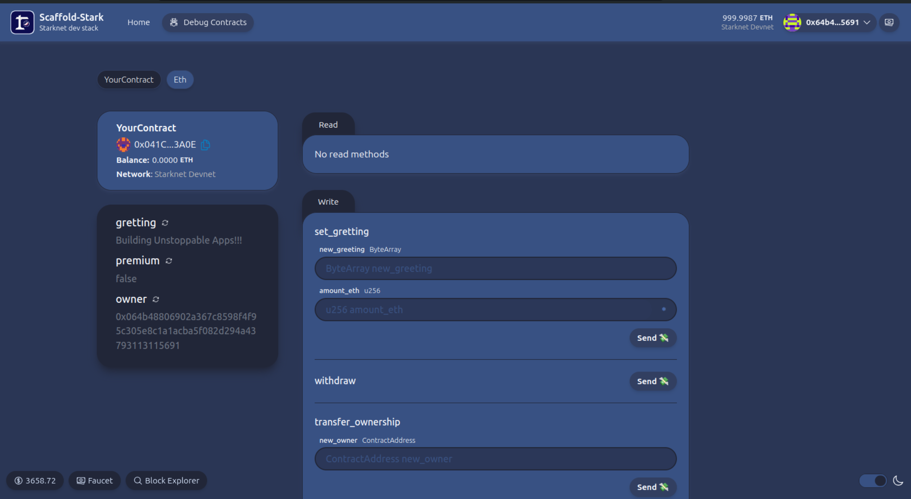

# 🏗 Scaffold-Stark 2

<h4 align="center">
  <a href="https://www.docs.scaffoldstark.com/">Documentation</a> |
  <a href="https://www.scaffoldstark.com/">Website</a>
</h4>

🧪 An open-source, up-to-date toolkit for building decentralized applications (dapps) on Starknet blockchain. It's designed to make it easier for developers to create and deploy smart contracts and build user interfaces that interact with those contracts.

⚙️ Built using NextJS, Starknet.js, Scarb, Starknet-React, Starknet Foundry and Typescript.

- ✅ **Contract Fast Reload**: Your frontend auto-adapts to your smart contracts as you deploy them.
- 🪝 [**Custom hooks**](https://www.docs.scaffoldstark.com/hooks/): Collection of React hooks wrapper around [starknet-react](https://starknet-react.com/) to simplify interactions with smart contracts with typescript autocompletion.
- 🧱 [**Components**](https://www.docs.scaffoldstark.com/components): Collection of common web3 components to quickly build your frontend.
- 🔥 **Burner Wallet & Prefunded Account**: Quickly test your application with a burner wallet and prefunded accounts.
- 🔐 **Integration with Wallet Providers**: Connect to different wallet providers and interact with Starknet network.



## Requirements

Before you begin, you need to install the following tools:

- [Node (>= v18.17)](https://nodejs.org/en/download/)
- Yarn ([v1](https://classic.yarnpkg.com/en/docs/install/) or [v2+](https://yarnpkg.com/getting-started/install))
- [Git](https://git-scm.com/downloads)

### Scarb version

To ensure the proper functioning of scaffold-stark, your local `Scarb` version must be `2.5.4`. To accomplish this, first check your local Scarb version:

```sh
scarb --version
```

If your local Scarb version is not `2.5.4`, you need to install it.

<details>
<summary><b>Scarb Installation Process</b></summary>

To install Scarb, please refer to the [installation instructions](https://docs.swmansion.com/scarb/download).
We strongly recommend that you install
Scarb via [asdf](https://docs.swmansion.com/scarb/download.html#install-via-asdf), a CLI tool that can manage
multiple language runtime versions on a per-project basis.
This will ensure that the version of Scarb you use to work on a project always matches the one defined in the
project settings, avoiding problems related to version mismatches.

Please refer to the [asdf documentation](https://asdf-vm.com/guide/getting-started.html) to install all
prerequisites.

Once you have `asdf` installed locally, you can download Scarb plugin with the following command:

```bash
asdf plugin add scarb
```

This will allow you to download specific versions. You can choose the same version as the Dojo's Cairo version, for example, 2.5.4, with the following command:

```bash
asdf install scarb 2.5.4
```

and set a global version:

```bash
asdf global scarb 2.5.4
```

Otherwise, you can simply run the following command in your terminal, and follow the onscreen instructions. This
will install the version `2.5.4` of Scarb.

```bash
curl --proto '=https' --tlsv1.2 -sSf https://docs.swmansion.com/scarb/install.sh | sh -s -- -v 2.5.4
```

</details>

### Starknet Foundry version

To ensure the proper functioning of the tests on scaffold-stark, your Starknet Foundry version must be 0.25.0. To accomplish this, first check your Starknet Foundry version:

```sh
snforge --version
```

If your Starknet Foundry version is not `0.25.0`, you need to install it.

- [Starknet Foundry](https://foundry-rs.github.io/starknet-foundry/getting-started/installation.html)

## Compatible versions

- Scarb - v2.5.4
- Snforge - v0.23
- Cairo - v2.5.4
- Rpc - v0.5.1

## Quickstart

To get started with Scaffold-Stark 2, follow the steps below:

1. Clone this repo and install dependencies

```bash
git clone https://github.com/Quantum3-Labs/scaffold-stark-2 --recurse-submodules
cd scaffold-stark-2
yarn install
```

2. Prepare your environment variables.

By default Scaffold-Stark 2 takes the first prefunded account from `starknet-devnet` as a deployer address, thus **you can skip this step!**. But if you want use the .env file anyway, you can fill the envs related to devnet with any other predeployed contract address and private key from starknet-devnet.

**Note:** In case you want to deploy on Sepolia, you need to fill the envs related to sepolia testnet with your own contract address and private key.

```bash
cp packages/snfoundry/.env.example packages/snfoundry/.env
```

3. Run a local network in the first terminal.

**Note:** You can skip this step if you want to use Sepolia Testnet.

```bash
yarn chain
```

This command starts a local Starknet network using Devnet. The network runs on your local machine and can be used for testing and development. You can customize the network configuration in `scaffold.config.ts` for your nextjs app.

**Note:** If you are on sepolia or mainnet, for a better user experience on your app, you can get a dedicated RPC from [Infura dashboard](https://www.infura.io/). A default is provided [here](https://github.com/Quantum3-Labs/scaffold-stark-2/tree/main/packages/nextjs/.env.example), in order to use this, you have to run `cp packages/nextjs/.env.example packages/nextjs/.env.local`


4. On a second terminal, deploy the sample contract:

```
yarn deploy --network {NETWORK_NAME} // when NETWORK_NAME is not specified, it defaults to "devnet"
```

**Note:** To use sepolia tesnet, you have to set {NETWORK_NAME} to `sepolia`.


This command deploys a sample smart contract to the local network. The contract is located in `packages/snfoundry/contracts/src` and can be modified to suit your needs. The `yarn deploy` command uses the deploy script located in `packages/snfoundry/scripts-ts/deploy.ts` to deploy the contract to the network. You can also customize the deploy script.

5. On a third terminal, start your NextJS app:

```
yarn start
```

Visit your app on: `http://localhost:3000`. You can interact with your smart contract using the `Debug Contracts` page. You can tweak the app config in `packages/nextjs/scaffold.config.ts`.

**What's next**:

- Edit your smart contract `YourContract.cairo` in `packages/snfoundry/contracts/src`
- Edit your frontend homepage at `packages/nextjs/app/page.tsx`. For guidance on [routing](https://nextjs.org/docs/app/building-your-application/routing/defining-routes) and configuring [pages/layouts](https://nextjs.org/docs/app/building-your-application/routing/pages-and-layouts) checkout the Next.js documentation.
- Edit your deployment scripts in `packages/snfoundry/script-ts/deploy.ts`
- Edit your smart contract tests in `packages/snfoundry/contracts/src/test`. To run tests use `yarn test`

## Documentation

Visit our [docs](https://www.docs.scaffoldstark.com/) to learn how to start building with Scaffold-Stark 2.

To know more about its features, check out our [website](https://scaffoldstark.com)

## Contributing to Scaffold-Stark 2

We welcome contributions to Scaffold-Stark 2!

Please see [CONTRIBUTING.MD](https://github.com/Quantum3-Labs/scaffold-stark-2/blob/main/CONTRIBUTING.md) for more information and guidelines for contributing to Scaffold-Stark 2.
